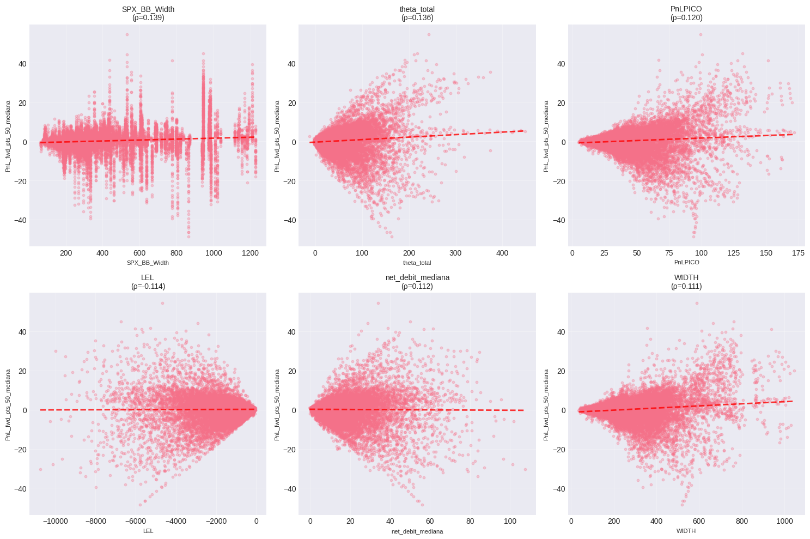
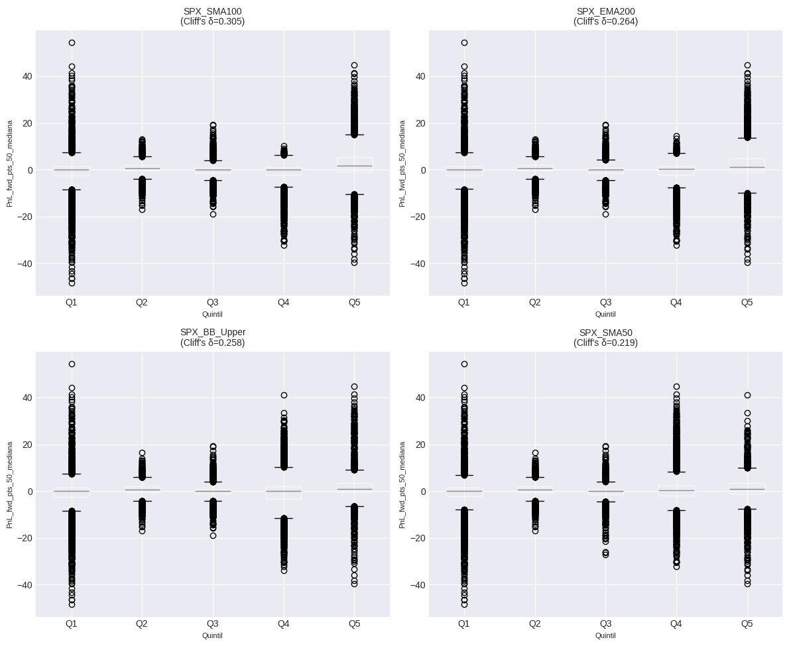
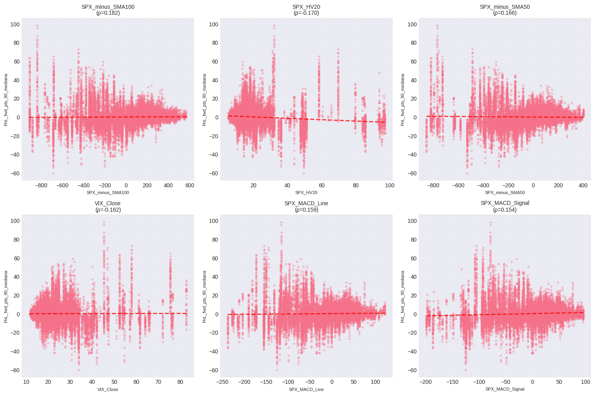
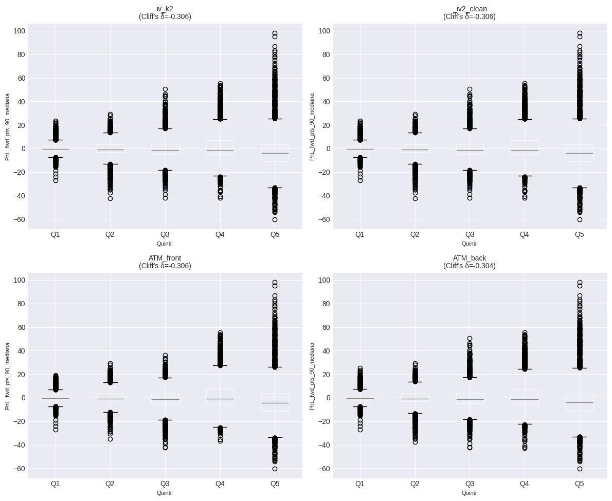

# RESUMEN EJECUTIVO
## Hallazgos Accionables (Top 10)

- **SPX_BB_Width** correlaciona 0.139 con PnL_fwd_pts_50_mediana (p_adj=0.0000, N=20,408)
- **theta_total** correlaciona 0.136 con PnL_fwd_pts_50_mediana (p_adj=0.0000, N=20,408)
- **PnLPICO** correlaciona 0.120 con PnL_fwd_pts_50_mediana (p_adj=0.0000, N=20,408)
- **SPX_SMA100**: Quintil superior vs inferior → Δ mediana = 1.70 puntos (Cliff's δ=0.305, p=0.0000)
- **SPX_EMA200**: Quintil superior vs inferior → Δ mediana = 1.25 puntos (Cliff's δ=0.264, p=0.0000)
- **SPX_minus_SMA100** correlaciona 0.182 con PnL_fwd_pts_90_mediana (p_adj=0.0000, N=20,408)
- **SPX_HV20** correlaciona -0.170 con PnL_fwd_pts_90_mediana (p_adj=0.0000, N=20,408)
- **SPX_minus_SMA50** correlaciona 0.166 con PnL_fwd_pts_90_mediana (p_adj=0.0000, N=20,408)
- **iv_k2**: Quintil superior vs inferior → Δ mediana = -3.54 puntos (Cliff's δ=-0.306, p=0.0000)
- **_iv2_clean**: Quintil superior vs inferior → Δ mediana = -3.54 puntos (Cliff's δ=-0.306, p=0.0000)

# ANÁLISIS PREDICTIVO - CALENDAR SPREADS
## 1. VALIDACIÓN INICIAL DE DATOS
**Tamaño muestral:** N = 20,745 registros
**Columnas totales:** 117
**Período:** 2019-01-02 a 2025-11-24

**Target PnL_fwd_pts_50_mediana:**
  - Valores válidos: 20,562 (99.1%)
  - Media: 0.14
  - Mediana: 0.35
  - Std: 5.92

**Target PnL_fwd_pts_90_mediana:**
  - Valores válidos: 20,424 (98.5%)
  - Media: -0.14
  - Mediana: -1.10
  - Std: 10.77

## 2. CONTROL ANTI-LEAKAGE
**Columnas excluidas por leakage:** 22
```
  - PnL_fwd_pct_25
  - PnL_fwd_pct_25_mediana
  - PnL_fwd_pct_50
  - PnL_fwd_pct_50_mediana
  - PnL_fwd_pct_90
  - PnL_fwd_pct_90_mediana
  - PnL_fwd_pts_25
  - PnL_fwd_pts_25_mediana
  - PnL_fwd_pts_50
  - PnL_fwd_pts_90
  - SPX_chg_pct_25
  - SPX_chg_pct_50
  - SPX_chg_pct_90
  - dia_fwd_25
  - dia_fwd_50
  - dia_fwd_90
  - hora_fwd_25
  - hora_fwd_50
  - hora_fwd_90
  - net_debit_fwd_25
  - net_debit_fwd_50
  - net_debit_fwd_90
```

**Features permitidas (numéricas):** 84

## 3. CALIDAD DE DATOS
**Features con NaNs:** 3
```
  BE_R: 19 (0.1%)
  RATIO W/nd: 19 (0.1%)
  WIDTH: 19 (0.1%)
```

**Filas duplicadas:** 0

**Registros válidos para análisis:** 20,408

## 4. CORRELACIONES BASELINE - PnL_fwd_pts_50_mediana
### Top 20 Features por Correlación de Spearman

| Feature | r_Spearman | p_adj | r_Pearson | N |
|---------|------------|-------|-----------|---|
| SPX_BB_Width | 0.1386*** | 0.0000 | 0.0994 | 20,408 |
| theta_total | 0.1359*** | 0.0000 | 0.0962 | 20,408 |
| PnLPICO | 0.1202*** | 0.0000 | 0.1017 | 20,408 |
| LEL | -0.1138*** | 0.0000 | 0.0066 | 20,408 |
| net_debit_mediana | 0.1120*** | 0.0000 | -0.0109 | 20,408 |
| WIDTH | 0.1114*** | 0.0000 | 0.1274 | 20,389 |
| UEL | -0.1109*** | 0.0000 | 0.0105 | 20,408 |
| CQR | 0.1106*** | 0.0000 | 0.0420 | 20,408 |
| Ratio_T2_T1 | 0.1105*** | 0.0000 | -0.0039 | 20,408 |
| IV_Ratio | 0.1103*** | 0.0000 | 0.0768 | 20,408 |
| net_debit | 0.1103*** | 0.0000 | -0.0102 | 20,408 |
| SPX_SMA50_200_Diff | -0.1077*** | 0.0000 | -0.0952 | 20,408 |
| _tau | 0.1007*** | 0.0000 | -0.0255 | 20,408 |
| SPX_BB_Upper | 0.0979*** | 0.0000 | 0.0708 | 20,408 |
| DTE_k1 | -0.0948*** | 0.0000 | -0.0343 | 20,408 |
| SPX_ATR14 | 0.0918*** | 0.0000 | 0.0494 | 20,408 |
| SPX_EMA200 | 0.0890*** | 0.0000 | 0.0919 | 20,408 |
| SPX_SMA50 | 0.0886*** | 0.0000 | 0.0719 | 20,408 |
| SPX_minus_SMA7 | 0.0875*** | 0.0000 | -0.0139 | 20,408 |
| SPX_SMA100 | 0.0870*** | 0.0000 | 0.0821 | 20,408 |

*Significancia: *** p<0.001, ** p<0.01, * p<0.05 (FDR ajustado)*

## 5. REGLAS POR UMBRALES Y CUANTILES - PnL_fwd_pts_50_mediana
### Top Reglas por Cuantiles (Quintiles)

| Feature | Top Q1 Median | Bottom Q5 Median | Δ Median | Cliff's δ | p-value |
|---------|---------------|------------------|----------|-----------|----------|
| SPX_SMA100 | 1.73 | 0.03 | 1.70 | 0.305 | 0.0000 |
| SPX_EMA200 | 1.27 | 0.03 | 1.25 | 0.264 | 0.0000 |
| SPX_BB_Upper | 1.00 | 0.03 | 0.97 | 0.258 | 0.0000 |
| SPX_SMA50 | 0.94 | -0.03 | 0.96 | 0.219 | 0.0000 |
| SPX_BB_Width | 1.07 | 0.00 | 1.07 | 0.191 | 0.0000 |
| CQR | 1.52 | 0.20 | 1.32 | 0.186 | 0.0000 |
| theta_total | 2.09 | 0.15 | 1.94 | 0.181 | 0.0000 |
| IV_Ratio | 1.68 | 0.20 | 1.48 | 0.173 | 0.0000 |
| PnLPICO | 1.98 | 0.15 | 1.83 | 0.155 | 0.0000 |
| Ratio_T2_T1 | 1.50 | 0.15 | 1.35 | 0.154 | 0.0000 |
| DTE_k1 | 0.17 | 0.78 | -0.60 | -0.143 | 0.0000 |
| WIDTH | 1.55 | 0.15 | 1.40 | 0.141 | 0.0000 |
| LEL | 0.15 | 1.52 | -1.38 | -0.125 | 0.0000 |
| net_debit_mediana | 1.48 | 0.15 | 1.33 | 0.124 | 0.0000 |
| _tau | 1.40 | 0.15 | 1.25 | 0.124 | 0.0000 |

## 6. ANÁLISIS ESPECIAL VIX - PnL_fwd_pts_50_mediana
### Correlaciones VIX Features

| Feature | r_Spearman | p-value | Interpretación |
|---------|------------|---------|----------------|
| VIX_ROC_5 | 0.0017 | 0.8034 | - No sig. |
| VIX_slope_5 | -0.0091 | 0.1950 | - No sig. |
| VIX_zscore_5 | 0.0016 | 0.9695 | - No sig. |
| VIX_SMA_5 | 0.0578 | 0.0000 | · Débil |
| VIX_above_SMA_5 | 0.0038 | 0.5886 | - No sig. |
| VIX_ROC_10 | 0.0060 | 0.3876 | - No sig. |
| VIX_slope_10 | 0.0204 | 0.0036 | · Débil |
| VIX_zscore_10 | 0.0014 | 0.9412 | - No sig. |
| VIX_SMA_10 | 0.0573 | 0.0000 | · Débil |
| VIX_above_SMA_10 | 0.0036 | 0.6084 | - No sig. |
| VIX_ROC_20 | 0.0127 | 0.0704 | - No sig. |
| VIX_slope_20 | 0.0163 | 0.0202 | · Débil |
| VIX_zscore_20 | 0.0115 | 0.4149 | - No sig. |
| VIX_SMA_20 | 0.0566 | 0.0000 | · Débil |
| VIX_above_SMA_20 | 0.0102 | 0.1437 | - No sig. |

### VIX por Quintiles

- **Δ Mediana (Q5 vs Q1):** 0.72
- **Cliff's Delta:** 0.099
- **p-value:** 0.0000

| Quintil | N | Median | Mean | Std |
|---------|---|--------|------|-----|
| Q1 | 4087 | 0.25 | 0.18 | 1.59 |
| Q2 | 4078 | 0.45 | 0.10 | 3.42 |
| Q3 | 4102 | 0.20 | -0.28 | 3.96 |
| Q4 | 4071 | 0.38 | -0.02 | 5.19 |
| Q5 | 4070 | 0.97 | 0.66 | 10.93 |

## 7. FEATURE ENGINEERING - PnL_fwd_pts_50_mediana
Trabajando con top 10 features...

### Top Features Derivadas

| Feature Derivada | r_Spearman | p-value |
|------------------|------------|----------|
| SPX_BB_Width_rank | 0.1386*** | 0.0000 |
| SPX_BB_Width_log | 0.1386*** | 0.0000 |
| SPX_BB_Width_zscore | 0.1386*** | 0.0000 |
| theta_total_log | 0.1359*** | 0.0000 |
| theta_total_rank | 0.1359*** | 0.0000 |
| theta_total_zscore | 0.1359*** | 0.0000 |
| PnLPICO_rank | 0.1202*** | 0.0000 |
| PnLPICO_log | 0.1202*** | 0.0000 |
| PnLPICO_zscore | 0.1202*** | 0.0000 |
| theta_total_div_PnLPICO | 0.1158*** | 0.0000 |
| LEL_rank | -0.1138*** | 0.0000 |
| LEL_log | 0.1138*** | 0.0000 |
| LEL_zscore | -0.1138*** | 0.0000 |
| net_debit_mediana_log | 0.1120*** | 0.0000 |
| net_debit_mediana_rank | 0.1120*** | 0.0000 |

## 8. VALIDACIÓN OUT-OF-SAMPLE - PnL_fwd_pts_50_mediana
**Validación:** TimeSeriesSplit con 5 folds
**Features usadas:** 10
**Muestras:** 20,389

### Resultados OOS por Modelo

| Modelo | MAE | R² | Spearman |
|--------|-----|-----|----------|
| Ridge | 3.507 ± 1.300 | -0.275 ± 0.359 | 0.028 ± 0.109 |
| Lasso | 3.337 ± 1.382 | -0.110 ± 0.192 | -0.010 ± 0.124 |

❌ **Conclusión:** NO hay señal predictiva consistente OOS

## 9. VISUALIZACIONES - PnL_fwd_pts_50_mediana




## 4. CORRELACIONES BASELINE - PnL_fwd_pts_90_mediana
### Top 20 Features por Correlación de Spearman

| Feature | r_Spearman | p_adj | r_Pearson | N |
|---------|------------|-------|-----------|---|
| SPX_minus_SMA100 | 0.1818*** | 0.0000 | 0.0136 | 20,408 |
| SPX_HV20 | -0.1704*** | 0.0000 | -0.1092 | 20,408 |
| SPX_minus_SMA50 | 0.1662*** | 0.0000 | -0.0218 | 20,408 |
| VIX_Close | -0.1620*** | 0.0000 | 0.0049 | 20,408 |
| SPX_MACD_Line | 0.1589*** | 0.0000 | 0.0217 | 20,408 |
| SPX_MACD_Signal | 0.1535*** | 0.0000 | 0.0658 | 20,408 |
| iv_k2 | -0.1521*** | 0.0000 | -0.0096 | 20,408 |
| _iv2_clean | -0.1521*** | 0.0000 | -0.0096 | 20,408 |
| ATM_back | -0.1501*** | 0.0000 | -0.0090 | 20,408 |
| SPX_ZScore50 | 0.1499*** | 0.0000 | -0.0232 | 20,408 |
| iv_k1 | -0.1494*** | 0.0000 | 0.0003 | 20,408 |
| ATM_front | -0.1486*** | 0.0000 | 0.0010 | 20,408 |
| SPX_HV50 | -0.1450*** | 0.0000 | -0.0891 | 20,408 |
| SPX_minus_SMA200 | 0.1413*** | 0.0000 | 0.0195 | 20,408 |
| SPX_ROC20 | 0.1277*** | 0.0000 | -0.0275 | 20,408 |
| PnLPICO | -0.1227*** | 0.0000 | 0.0102 | 20,408 |
| T2_mid_30min | -0.1192*** | 0.0000 | -0.0498 | 20,408 |
| price_mid_long | -0.1192*** | 0.0000 | -0.0498 | 20,408 |
| UEL | 0.1167*** | 0.0000 | -0.0259 | 20,408 |
| WIDTH | -0.1165*** | 0.0000 | 0.0034 | 20,389 |

*Significancia: *** p<0.001, ** p<0.01, * p<0.05 (FDR ajustado)*

## 5. REGLAS POR UMBRALES Y CUANTILES - PnL_fwd_pts_90_mediana
### Top Reglas por Cuantiles (Quintiles)

| Feature | Top Q1 Median | Bottom Q5 Median | Δ Median | Cliff's δ | p-value |
|---------|---------------|------------------|----------|-----------|----------|
| iv_k2 | -4.15 | -0.61 | -3.54 | -0.306 | 0.0000 |
| _iv2_clean | -4.15 | -0.61 | -3.54 | -0.306 | 0.0000 |
| ATM_front | -4.33 | -0.62 | -3.70 | -0.306 | 0.0000 |
| ATM_back | -4.08 | -0.62 | -3.45 | -0.304 | 0.0000 |
| SPX_minus_SMA200 | 0.20 | -2.95 | 3.15 | 0.303 | 0.0000 |
| SPX_HV50 | -2.73 | -0.49 | -2.23 | -0.302 | 0.0000 |
| iv_k1 | -4.40 | -0.62 | -3.78 | -0.300 | 0.0000 |
| VIX_Close | -4.21 | -0.70 | -3.51 | -0.280 | 0.0000 |
| SPX_HV20 | -3.55 | -0.93 | -2.62 | -0.267 | 0.0000 |
| SPX_MACD_Signal | -0.65 | -3.52 | 2.88 | 0.206 | 0.0000 |
| T2_mid_30min | -3.65 | -0.78 | -2.88 | -0.205 | 0.0000 |
| price_mid_long | -3.65 | -0.78 | -2.88 | -0.205 | 0.0000 |
| SPX_MACD_Line | -0.35 | -3.48 | 3.12 | 0.189 | 0.0000 |
| SPX_minus_SMA100 | -0.25 | -2.65 | 2.40 | 0.166 | 0.0000 |
| PnLPICO | -4.27 | -0.88 | -3.39 | -0.154 | 0.0000 |

## 6. ANÁLISIS ESPECIAL VIX - PnL_fwd_pts_90_mediana
### Correlaciones VIX Features

| Feature | r_Spearman | p-value | Interpretación |
|---------|------------|---------|----------------|
| VIX_ROC_5 | -0.0160 | 0.0220 | · Débil |
| VIX_slope_5 | 0.0051 | 0.4633 | - No sig. |
| VIX_zscore_5 | -0.0246 | 0.5529 | - No sig. |
| VIX_SMA_5 | -0.1614 | 0.0000 | ✓ Moderada |
| VIX_above_SMA_5 | -0.0140 | 0.0451 | · Débil |
| VIX_ROC_10 | -0.0207 | 0.0031 | · Débil |
| VIX_slope_10 | -0.0336 | 0.0000 | · Débil |
| VIX_zscore_10 | -0.0206 | 0.2669 | - No sig. |
| VIX_SMA_10 | -0.1607 | 0.0000 | ✓ Moderada |
| VIX_above_SMA_10 | -0.0180 | 0.0101 | · Débil |
| VIX_ROC_20 | -0.0137 | 0.0510 | - No sig. |
| VIX_slope_20 | 0.0002 | 0.9819 | - No sig. |
| VIX_zscore_20 | -0.0283 | 0.0449 | · Débil |
| VIX_SMA_20 | -0.1602 | 0.0000 | ✓ Moderada |
| VIX_above_SMA_20 | -0.0142 | 0.0419 | · Débil |

### VIX por Quintiles

- **Δ Mediana (Q5 vs Q1):** -3.51
- **Cliff's Delta:** -0.280
- **p-value:** 0.0000

| Quintil | N | Median | Mean | Std |
|---------|---|--------|------|-----|
| Q1 | 4087 | -0.70 | 0.09 | 4.00 |
| Q2 | 4078 | -0.23 | 0.37 | 6.93 |
| Q3 | 4102 | -1.25 | 0.33 | 8.66 |
| Q4 | 4071 | -1.73 | 0.65 | 12.09 |
| Q5 | 4070 | -4.21 | -2.14 | 17.04 |

## 7. FEATURE ENGINEERING - PnL_fwd_pts_90_mediana
Trabajando con top 10 features...

### Top Features Derivadas

| Feature Derivada | r_Spearman | p-value |
|------------------|------------|----------|
| SPX_minus_SMA100_div_SPX_minus_SMA50 | 0.2014*** | 0.0000 |
| SPX_minus_SMA100_div_SPX_MACD_Line | 0.1918*** | 0.0000 |
| SPX_minus_SMA100_rank | 0.1818*** | 0.0000 |
| SPX_minus_SMA100_zscore | 0.1818*** | 0.0000 |
| SPX_minus_SMA100_div_VIX_Close | 0.1803*** | 0.0000 |
| SPX_minus_SMA100_div_SPX_MACD_Signal | 0.1776*** | 0.0000 |
| SPX_HV20_rank | -0.1704*** | 0.0000 |
| SPX_HV20_log | -0.1704*** | 0.0000 |
| SPX_HV20_zscore | -0.1704*** | 0.0000 |
| SPX_minus_SMA50_rank | 0.1662*** | 0.0000 |
| SPX_minus_SMA50_zscore | 0.1662*** | 0.0000 |
| SPX_minus_SMA50_div_SPX_MACD_Signal | 0.1640*** | 0.0000 |
| VIX_Close_rank | -0.1620*** | 0.0000 |
| VIX_Close_log | -0.1620*** | 0.0000 |
| VIX_Close_zscore | -0.1620*** | 0.0000 |

## 8. VALIDACIÓN OUT-OF-SAMPLE - PnL_fwd_pts_90_mediana
**Validación:** TimeSeriesSplit con 5 folds
**Features usadas:** 10
**Muestras:** 20,408

### Resultados OOS por Modelo

| Modelo | MAE | R² | Spearman |
|--------|-----|-----|----------|
| Ridge | 7.451 ± 2.621 | -0.170 ± 0.153 | -0.054 ± 0.183 |
| Lasso | 7.127 ± 2.466 | -0.118 ± 0.106 | -0.043 ± 0.198 |

❌ **Conclusión:** NO hay señal predictiva consistente OOS

## 9. VISUALIZACIONES - PnL_fwd_pts_90_mediana




