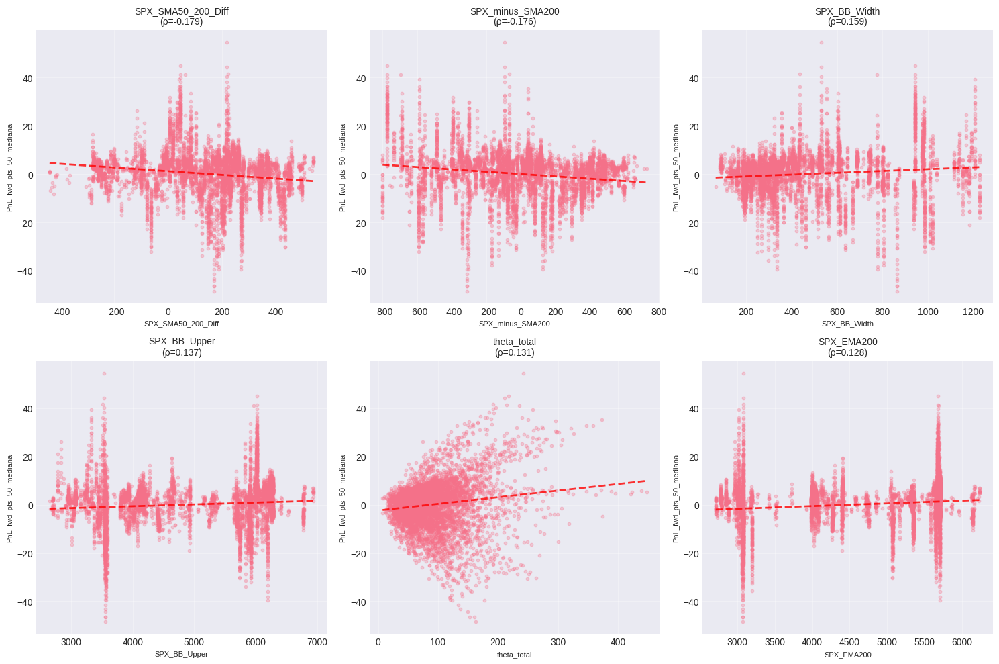
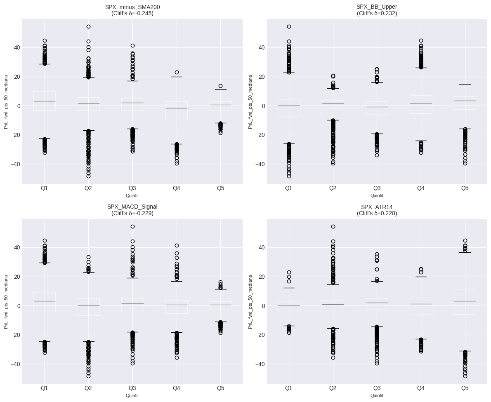
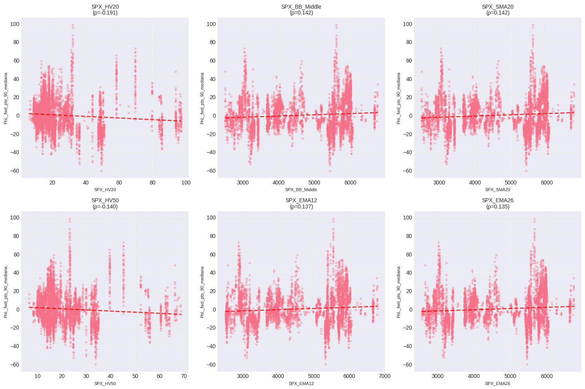
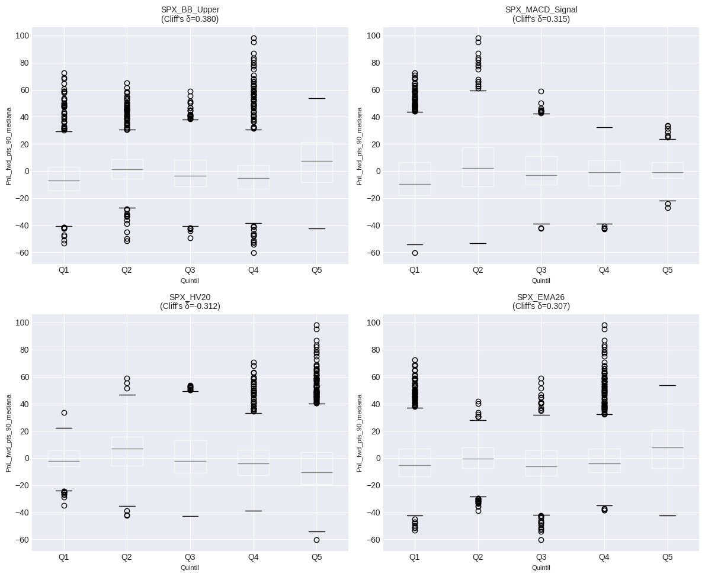

# RESUMEN EJECUTIVO
## Hallazgos Accionables (Top 10)

- **SPX_SMA50_200_Diff** correlaciona -0.179 con PnL_fwd_pts_50_mediana (p_adj=0.0000, N=6,624)
- **SPX_minus_SMA200** correlaciona -0.176 con PnL_fwd_pts_50_mediana (p_adj=0.0000, N=6,624)
- **SPX_BB_Width** correlaciona 0.159 con PnL_fwd_pts_50_mediana (p_adj=0.0000, N=6,624)
- **SPX_minus_SMA200**: Quintil superior vs inferior → Δ mediana = -2.45 puntos (Cliff's δ=-0.245, p=0.0000)
- **SPX_BB_Upper**: Quintil superior vs inferior → Δ mediana = 3.42 puntos (Cliff's δ=0.232, p=0.0000)
- **SPX_HV20** correlaciona -0.191 con PnL_fwd_pts_90_mediana (p_adj=0.0000, N=6,624)
- **SPX_BB_Middle** correlaciona 0.142 con PnL_fwd_pts_90_mediana (p_adj=0.0000, N=6,624)
- **SPX_SMA20** correlaciona 0.142 con PnL_fwd_pts_90_mediana (p_adj=0.0000, N=6,624)
- **SPX_BB_Upper**: Quintil superior vs inferior → Δ mediana = 14.43 puntos (Cliff's δ=0.380, p=0.0000)
- **SPX_MACD_Signal**: Quintil superior vs inferior → Δ mediana = 8.75 puntos (Cliff's δ=0.315, p=0.0000)

# ANÁLISIS PREDICTIVO - CALENDAR SPREADS
## 1. VALIDACIÓN INICIAL DE DATOS
**FILTRO APLICADO: DTE2 - DTE1 >= 10 días**
- Registros originales: 20,745
- Registros después del filtro: 6,719 (32.4%)
- Registros eliminados: 14,026

**Tamaño muestral:** N = 6,719 registros
**Columnas totales:** 120
**Período:** 2019-01-02 a 2025-11-21

**Target PnL_fwd_pts_50_mediana:**
  - Valores válidos: 6,647 (98.9%)
  - Media: 0.09
  - Mediana: 1.20
  - Std: 9.65

**Target PnL_fwd_pts_90_mediana:**
  - Valores válidos: 6,624 (98.6%)
  - Media: -0.12
  - Mediana: -2.45
  - Std: 16.85

## 2. CONTROL ANTI-LEAKAGE
**Columnas excluidas por leakage:** 22
```
  - PnL_fwd_pct_25
  - PnL_fwd_pct_25_mediana
  - PnL_fwd_pct_50
  - PnL_fwd_pct_50_mediana
  - PnL_fwd_pct_90
  - PnL_fwd_pct_90_mediana
  - PnL_fwd_pts_25
  - PnL_fwd_pts_25_mediana
  - PnL_fwd_pts_50
  - PnL_fwd_pts_90
  - SPX_chg_pct_25
  - SPX_chg_pct_50
  - SPX_chg_pct_90
  - dia_fwd_25
  - dia_fwd_50
  - dia_fwd_90
  - hora_fwd_25
  - hora_fwd_50
  - hora_fwd_90
  - net_debit_fwd_25
  - net_debit_fwd_50
  - net_debit_fwd_90
```

**Features permitidas (numéricas):** 87

## 3. CALIDAD DE DATOS
**Filas duplicadas:** 0

**Registros válidos para análisis:** 6,624

## 4. CORRELACIONES BASELINE - PnL_fwd_pts_50_mediana
### Top 20 Features por Correlación de Spearman

| Feature | r_Spearman | p_adj | r_Pearson | N |
|---------|------------|-------|-----------|---|
| SPX_SMA50_200_Diff | -0.1790*** | 0.0000 | -0.1563 | 6,624 |
| SPX_minus_SMA200 | -0.1756*** | 0.0000 | -0.1706 | 6,624 |
| SPX_BB_Width | 0.1593*** | 0.0000 | 0.1104 | 6,624 |
| SPX_BB_Upper | 0.1366*** | 0.0000 | 0.0913 | 6,624 |
| theta_total | 0.1315*** | 0.0000 | 0.1394 | 6,624 |
| SPX_EMA200 | 0.1281*** | 0.0000 | 0.1224 | 6,624 |
| SPX_SMA50 | 0.1264*** | 0.0000 | 0.0955 | 6,624 |
| SPX_SMA100 | 0.1220*** | 0.0000 | 0.1105 | 6,624 |
| SPX_minus_SMA100 | -0.1207*** | 0.0000 | -0.1488 | 6,624 |
| SPX_SMA200 | 0.1185*** | 0.0000 | 0.1302 | 6,624 |
| SPX_ATR14 | 0.1160*** | 0.0000 | 0.0533 | 6,624 |
| IV_Ratio | 0.1109*** | 0.0000 | 0.1429 | 6,624 |
| WIDTH | 0.1101*** | 0.0000 | 0.1680 | 6,624 |
| PnLPICO | 0.1075*** | 0.0000 | 0.1406 | 6,624 |
| SPX_EMA50 | 0.1060*** | 0.0000 | 0.0925 | 6,624 |
| FF_ATM | 0.1050*** | 0.0000 | 0.1906 | 6,624 |
| SPX_MACD_Signal | -0.1004*** | 0.0000 | -0.1014 | 6,624 |
| SPX_EMA26 | 0.0985*** | 0.0000 | 0.0826 | 6,624 |
| CQR_legacy | 0.0977*** | 0.0000 | 0.1787 | 6,624 |
| ATM_front | 0.0918*** | 0.0000 | 0.0224 | 6,624 |

*Significancia: *** p<0.001, ** p<0.01, * p<0.05 (FDR ajustado)*

## 5. REGLAS POR UMBRALES Y CUANTILES - PnL_fwd_pts_50_mediana
### Top Reglas por Cuantiles (Quintiles)

| Feature | Top Q1 Median | Bottom Q5 Median | Δ Median | Cliff's δ | p-value |
|---------|---------------|------------------|----------|-----------|----------|
| SPX_minus_SMA200 | 0.75 | 3.20 | -2.45 | -0.245 | 0.0000 |
| SPX_BB_Upper | 3.55 | 0.12 | 3.42 | 0.232 | 0.0000 |
| SPX_MACD_Signal | 0.75 | 3.25 | -2.50 | -0.229 | 0.0000 |
| SPX_ATR14 | 3.23 | 0.11 | 3.11 | 0.228 | 0.0000 |
| SPX_EMA26 | 3.02 | -0.07 | 3.10 | 0.219 | 0.0000 |
| SPX_SMA200 | 3.10 | -0.07 | 3.18 | 0.214 | 0.0000 |
| theta_total | 3.62 | 0.33 | 3.30 | 0.211 | 0.0000 |
| SPX_EMA50 | 3.00 | -0.07 | 3.08 | 0.203 | 0.0000 |
| SPX_SMA50 | 3.00 | -0.07 | 3.08 | 0.202 | 0.0000 |
| IV_Ratio | 2.90 | 0.35 | 2.55 | 0.201 | 0.0000 |
| PnLPICO | 3.80 | 0.78 | 3.02 | 0.191 | 0.0000 |
| SPX_SMA50_200_Diff | -0.29 | 1.45 | -1.74 | -0.185 | 0.0000 |
| CQR_legacy | 1.82 | 0.20 | 1.62 | 0.177 | 0.0000 |
| FF_ATM | 2.33 | 0.53 | 1.80 | 0.170 | 0.0000 |
| WIDTH | 3.38 | 0.78 | 2.60 | 0.169 | 0.0000 |

## 6. ANÁLISIS ESPECIAL VIX - PnL_fwd_pts_50_mediana
### Correlaciones VIX Features

| Feature | r_Spearman | p-value | Interpretación |
|---------|------------|---------|----------------|
| VIX_ROC_5 | 0.0188 | 0.1264 | - No sig. |
| VIX_slope_5 | 0.0104 | 0.3955 | - No sig. |
| VIX_zscore_5 | 0.0816 | 0.1161 | - No sig. |
| VIX_SMA_5 | 0.0497 | 0.0001 | · Débil |
| VIX_above_SMA_5 | 0.0111 | 0.3670 | - No sig. |
| VIX_ROC_10 | 0.0221 | 0.0719 | - No sig. |
| VIX_slope_10 | 0.0305 | 0.0131 | · Débil |
| VIX_zscore_10 | 0.0845 | 0.0055 | · Débil |
| VIX_SMA_10 | 0.0474 | 0.0001 | · Débil |
| VIX_above_SMA_10 | 0.0147 | 0.2318 | - No sig. |
| VIX_ROC_20 | 0.0120 | 0.3302 | - No sig. |
| VIX_slope_20 | 0.0213 | 0.0830 | - No sig. |
| VIX_zscore_20 | 0.0802 | 0.0018 | · Débil |
| VIX_SMA_20 | 0.0446 | 0.0003 | · Débil |
| VIX_above_SMA_20 | 0.0238 | 0.0531 | - No sig. |

### VIX por Quintiles

- **Δ Mediana (Q5 vs Q1):** 0.75
- **Cliff's Delta:** 0.044
- **p-value:** 0.0534

| Quintil | N | Median | Mean | Std |
|---------|---|--------|------|-----|
| Q1 | 1359 | 1.20 | 0.18 | 5.29 |
| Q2 | 1337 | 0.78 | -0.38 | 5.86 |
| Q3 | 1355 | 0.82 | -0.69 | 7.36 |
| Q4 | 1312 | 2.01 | 0.56 | 9.61 |
| Q5 | 1261 | 1.95 | 0.75 | 16.38 |

## 7. FEATURE ENGINEERING - PnL_fwd_pts_50_mediana
Trabajando con top 10 features...

### Top Features Derivadas

| Feature Derivada | r_Spearman | p-value |
|------------------|------------|----------|
| SPX_SMA50_200_Diff_div_SPX_EMA200 | -0.2388*** | 0.0000 |
| SPX_SMA50_200_Diff_div_SPX_BB_Upper | -0.2307*** | 0.0000 |
| SPX_minus_SMA100_log | 0.2151*** | 0.0000 |
| SPX_SMA50_200_Diff_log | -0.2071*** | 0.0000 |
| SPX_BB_Upper_div_SPX_EMA200 | -0.2003*** | 0.0000 |
| SPX_SMA50_200_Diff_div_SPX_BB_Width | -0.1878*** | 0.0000 |
| SPX_SMA50_200_Diff_rank | -0.1790*** | 0.0000 |
| SPX_SMA50_200_Diff_zscore | -0.1790*** | 0.0000 |
| SPX_minus_SMA200_rank | -0.1756*** | 0.0000 |
| SPX_minus_SMA200_zscore | -0.1756*** | 0.0000 |
| SPX_SMA50_200_Diff_div_theta_total | -0.1755*** | 0.0000 |
| SPX_minus_SMA200_div_SPX_BB_Width | -0.1691*** | 0.0000 |
| SPX_BB_Width_rank | 0.1593*** | 0.0000 |
| SPX_BB_Width_log | 0.1593*** | 0.0000 |
| SPX_BB_Width_zscore | 0.1593*** | 0.0000 |

## 8. VALIDACIÓN OUT-OF-SAMPLE - PnL_fwd_pts_50_mediana
**Validación:** TimeSeriesSplit con 5 folds
**Features usadas:** 10
**Muestras:** 6,624

### Resultados OOS por Modelo

| Modelo | MAE | R² | Spearman |
|--------|-----|-----|----------|
| Ridge | 8.103 ± 2.335 | -0.834 ± 0.814 | -0.058 ± 0.225 |
| Lasso | 7.496 ± 2.940 | -0.392 ± 0.534 | 0.005 ± 0.234 |

❌ **Conclusión:** NO hay señal predictiva consistente OOS

## 9. VISUALIZACIONES - PnL_fwd_pts_50_mediana




## 4. CORRELACIONES BASELINE - PnL_fwd_pts_90_mediana
### Top 20 Features por Correlación de Spearman

| Feature | r_Spearman | p_adj | r_Pearson | N |
|---------|------------|-------|-----------|---|
| SPX_HV20 | -0.1906*** | 0.0000 | -0.1005 | 6,624 |
| SPX_BB_Middle | 0.1420*** | 0.0000 | 0.0935 | 6,624 |
| SPX_SMA20 | 0.1420*** | 0.0000 | 0.0935 | 6,624 |
| SPX_HV50 | -0.1399*** | 0.0000 | -0.0849 | 6,624 |
| SPX_EMA12 | 0.1366*** | 0.0000 | 0.0905 | 6,624 |
| SPX_EMA26 | 0.1347*** | 0.0000 | 0.0913 | 6,624 |
| VIX_Close | -0.1347*** | 0.0000 | 0.0310 | 6,624 |
| DTE_k1 | -0.1305*** | 0.0000 | -0.1308 | 6,624 |
| DTE1 | -0.1305*** | 0.0000 | -0.1308 | 6,624 |
| SPX_BB_Lower | 0.1292*** | 0.0000 | 0.0932 | 6,624 |
| SPX_BB_Upper | 0.1279*** | 0.0000 | 0.0925 | 6,624 |
| SPX_SMA7 | 0.1266*** | 0.0000 | 0.0906 | 6,624 |
| SPX_EMA50 | 0.1263*** | 0.0000 | 0.0886 | 6,624 |
| _iv2_clean | -0.1197*** | 0.0000 | 0.0109 | 6,624 |
| iv_k2 | -0.1197*** | 0.0000 | 0.0109 | 6,624 |
| BE_R | 0.1167*** | 0.0000 | 0.0815 | 6,624 |
| ATM_back | -0.1166*** | 0.0000 | 0.0123 | 6,624 |
| iv_k1 | -0.1119*** | 0.0000 | 0.0233 | 6,624 |
| SPX_MACD_Signal | 0.1105*** | 0.0000 | 0.0509 | 6,624 |
| SPX_SMA50 | 0.1093*** | 0.0000 | 0.0861 | 6,624 |

*Significancia: *** p<0.001, ** p<0.01, * p<0.05 (FDR ajustado)*

## 5. REGLAS POR UMBRALES Y CUANTILES - PnL_fwd_pts_90_mediana
### Top Reglas por Cuantiles (Quintiles)

| Feature | Top Q1 Median | Bottom Q5 Median | Δ Median | Cliff's δ | p-value |
|---------|---------------|------------------|----------|-----------|----------|
| SPX_BB_Upper | 7.60 | -6.83 | 14.43 | 0.380 | 0.0000 |
| SPX_MACD_Signal | -0.75 | -9.50 | 8.75 | 0.315 | 0.0000 |
| SPX_HV20 | -10.58 | -2.15 | -8.43 | -0.312 | 0.0000 |
| SPX_EMA26 | 7.90 | -5.41 | 13.31 | 0.307 | 0.0000 |
| SPX_BB_Middle | 6.41 | -5.41 | 11.82 | 0.307 | 0.0000 |
| SPX_SMA20 | 6.41 | -5.41 | 11.82 | 0.307 | 0.0000 |
| SPX_SMA7 | 3.81 | -5.38 | 9.18 | 0.281 | 0.0000 |
| SPX_EMA12 | 4.25 | -5.41 | 9.66 | 0.280 | 0.0000 |
| DTE_k1 | -7.53 | -0.72 | -6.80 | -0.256 | 0.0000 |
| DTE1 | -7.53 | -0.72 | -6.80 | -0.256 | 0.0000 |
| SPX_HV50 | -6.66 | -1.54 | -5.12 | -0.244 | 0.0000 |
| SPX_EMA50 | 6.42 | -5.41 | 11.84 | 0.242 | 0.0000 |
| SPX_SMA50 | 6.38 | -5.42 | 11.80 | 0.241 | 0.0000 |
| iv_k1 | -8.40 | -0.57 | -7.83 | -0.237 | 0.0000 |
| ATM_back | -8.18 | -0.95 | -7.23 | -0.231 | 0.0000 |

## 6. ANÁLISIS ESPECIAL VIX - PnL_fwd_pts_90_mediana
### Correlaciones VIX Features

| Feature | r_Spearman | p-value | Interpretación |
|---------|------------|---------|----------------|
| VIX_ROC_5 | 0.0216 | 0.0782 | - No sig. |
| VIX_slope_5 | 0.0547 | 0.0000 | · Débil |
| VIX_zscore_5 | 0.0163 | 0.7533 | - No sig. |
| VIX_SMA_5 | -0.1354 | 0.0000 | · Débil |
| VIX_above_SMA_5 | 0.0176 | 0.1528 | - No sig. |
| VIX_ROC_10 | 0.0317 | 0.0099 | · Débil |
| VIX_slope_10 | 0.0161 | 0.1916 | - No sig. |
| VIX_zscore_10 | 0.0840 | 0.0058 | · Débil |
| VIX_SMA_10 | -0.1374 | 0.0000 | · Débil |
| VIX_above_SMA_10 | 0.0330 | 0.0072 | · Débil |
| VIX_ROC_20 | 0.0342 | 0.0054 | · Débil |
| VIX_slope_20 | 0.0504 | 0.0000 | · Débil |
| VIX_zscore_20 | 0.0336 | 0.1906 | - No sig. |
| VIX_SMA_20 | -0.1396 | 0.0000 | · Débil |
| VIX_above_SMA_20 | 0.0388 | 0.0016 | · Débil |

### VIX por Quintiles

- **Δ Mediana (Q5 vs Q1):** -7.38
- **Cliff's Delta:** -0.202
- **p-value:** 0.0000

| Quintil | N | Median | Mean | Std |
|---------|---|--------|------|-----|
| Q1 | 1359 | 0.17 | 0.10 | 10.63 |
| Q2 | 1337 | -0.15 | 1.65 | 12.71 |
| Q3 | 1355 | -1.27 | 2.46 | 16.79 |
| Q4 | 1312 | -6.61 | -3.81 | 17.31 |
| Q5 | 1261 | -7.20 | -1.14 | 23.64 |

## 7. FEATURE ENGINEERING - PnL_fwd_pts_90_mediana
Trabajando con top 10 features...

### Top Features Derivadas

| Feature Derivada | r_Spearman | p-value |
|------------------|------------|----------|
| SPX_HV20_div_SPX_EMA12 | -0.2095*** | 0.0000 |
| SPX_HV20_div_SPX_BB_Middle | -0.2092*** | 0.0000 |
| SPX_HV20_div_SPX_SMA20 | -0.2092*** | 0.0000 |
| SPX_HV20_div_SPX_EMA26 | -0.2090*** | 0.0000 |
| SPX_HV20_rank | -0.1906*** | 0.0000 |
| SPX_HV20_log | -0.1906*** | 0.0000 |
| SPX_HV20_zscore | -0.1906*** | 0.0000 |
| SPX_HV20_div_SPX_HV50 | -0.1837*** | 0.0000 |
| SPX_HV50_div_SPX_EMA26 | -0.1718*** | 0.0000 |
| SPX_BB_Middle_div_SPX_HV50 | 0.1717*** | 0.0000 |
| SPX_SMA20_div_SPX_HV50 | 0.1717*** | 0.0000 |
| SPX_HV50_div_SPX_EMA12 | -0.1713*** | 0.0000 |
| SPX_BB_Middle_rank | 0.1420*** | 0.0000 |
| SPX_BB_Middle_log | 0.1420*** | 0.0000 |
| SPX_BB_Middle_zscore | 0.1420*** | 0.0000 |

## 8. VALIDACIÓN OUT-OF-SAMPLE - PnL_fwd_pts_90_mediana
**Validación:** TimeSeriesSplit con 5 folds
**Features usadas:** 10
**Muestras:** 6,624

### Resultados OOS por Modelo

| Modelo | MAE | R² | Spearman |
|--------|-----|-----|----------|
| Ridge | 21.657 ± 16.601 | -3.966 ± 7.474 | -0.000 ± 0.194 |
| Lasso | 19.673 ± 13.134 | -2.747 ± 5.041 | 0.036 ± 0.258 |

❌ **Conclusión:** NO hay señal predictiva consistente OOS

## 9. VISUALIZACIONES - PnL_fwd_pts_90_mediana




