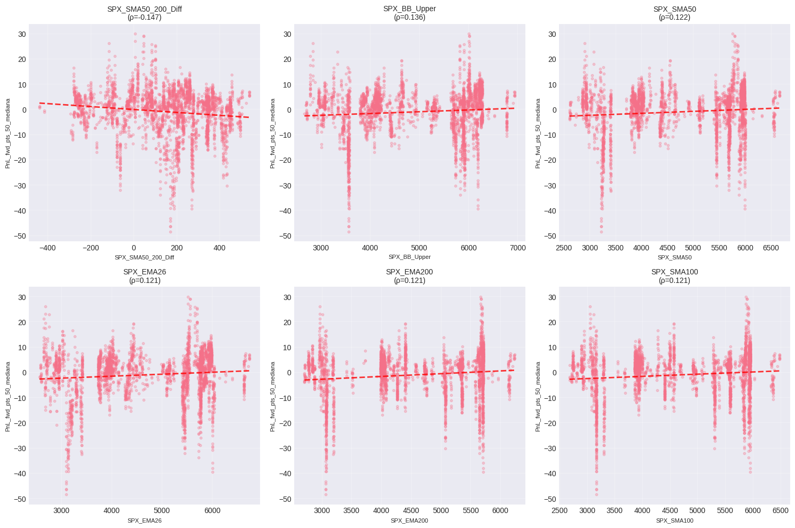
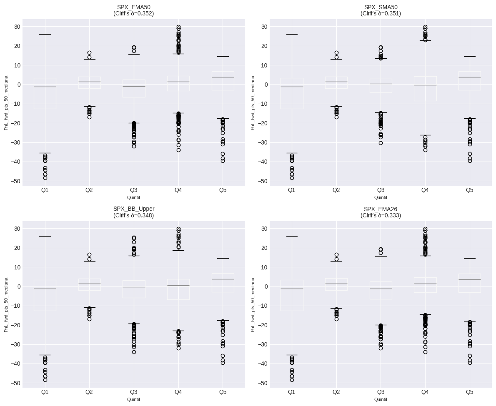
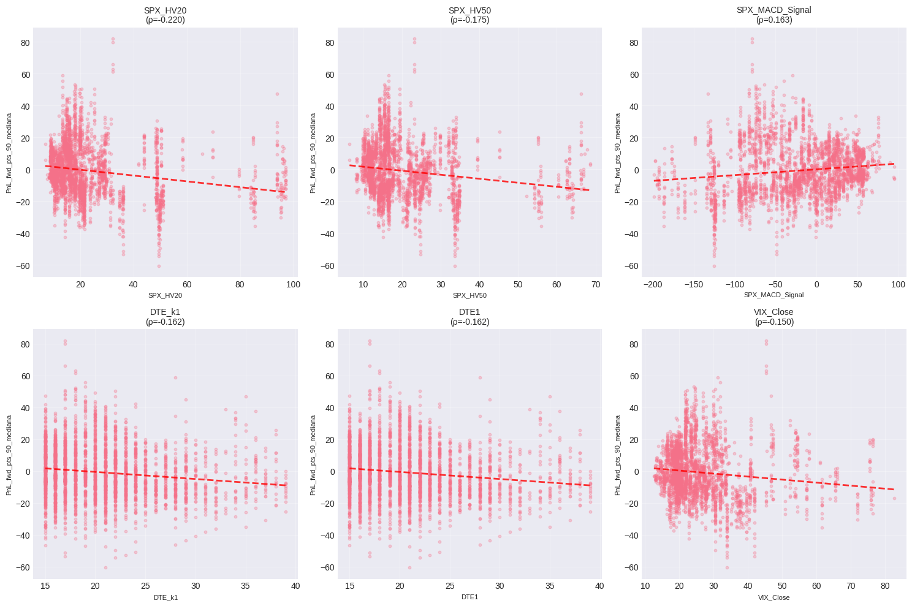
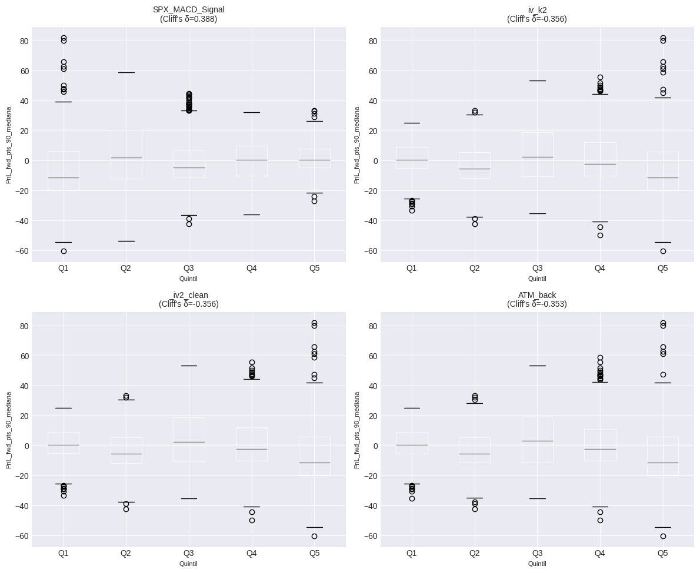

# RESUMEN EJECUTIVO
## Hallazgos Accionables (Top 10)

- **SPX_SMA50_200_Diff** correlaciona -0.147 con PnL_fwd_pts_50_mediana (p_adj=0.0000, N=3,398)
- **SPX_BB_Upper** correlaciona 0.136 con PnL_fwd_pts_50_mediana (p_adj=0.0000, N=3,398)
- **SPX_SMA50** correlaciona 0.122 con PnL_fwd_pts_50_mediana (p_adj=0.0000, N=3,398)
- **SPX_EMA50**: Quintil superior vs inferior → Δ mediana = 5.00 puntos (Cliff's δ=0.352, p=0.0000)
- **SPX_SMA50**: Quintil superior vs inferior → Δ mediana = 5.00 puntos (Cliff's δ=0.351, p=0.0000)
- **SPX_HV20** correlaciona -0.220 con PnL_fwd_pts_90_mediana (p_adj=0.0000, N=3,398)
- **SPX_HV50** correlaciona -0.175 con PnL_fwd_pts_90_mediana (p_adj=0.0000, N=3,398)
- **SPX_MACD_Signal** correlaciona 0.163 con PnL_fwd_pts_90_mediana (p_adj=0.0000, N=3,398)
- **SPX_MACD_Signal**: Quintil superior vs inferior → Δ mediana = 11.84 puntos (Cliff's δ=0.388, p=0.0000)
- **iv_k2**: Quintil superior vs inferior → Δ mediana = -11.72 puntos (Cliff's δ=-0.356, p=0.0000)

# ANÁLISIS PREDICTIVO - CALENDAR SPREADS
## 1. VALIDACIÓN INICIAL DE DATOS
**FILTROS APLICADOS:**
1. DTE2 - DTE1 > 10 días: 5,965 registros (28.8%)
2. FF_ATM < 0.3: 9,060 registros (43.7%)
3. **COMBINADOS (1 AND 2): 3,464 registros (16.7%)**
- Registros originales: 20,745
- Registros eliminados: 17,281

**Tamaño muestral:** N = 3,464 registros
**Columnas totales:** 120
**Período:** 2019-01-11 a 2025-11-21

**Target PnL_fwd_pts_50_mediana:**
  - Valores válidos: 3,417 (98.6%)
  - Media: -1.01
  - Mediana: 0.85
  - Std: 9.02

**Target PnL_fwd_pts_90_mediana:**
  - Valores válidos: 3,398 (98.1%)
  - Media: -0.75
  - Mediana: -2.50
  - Std: 16.35

## 2. CONTROL ANTI-LEAKAGE
**Columnas excluidas por leakage:** 22
```
  - PnL_fwd_pct_25
  - PnL_fwd_pct_25_mediana
  - PnL_fwd_pct_50
  - PnL_fwd_pct_50_mediana
  - PnL_fwd_pct_90
  - PnL_fwd_pct_90_mediana
  - PnL_fwd_pts_25
  - PnL_fwd_pts_25_mediana
  - PnL_fwd_pts_50
  - PnL_fwd_pts_90
  - SPX_chg_pct_25
  - SPX_chg_pct_50
  - SPX_chg_pct_90
  - dia_fwd_25
  - dia_fwd_50
  - dia_fwd_90
  - hora_fwd_25
  - hora_fwd_50
  - hora_fwd_90
  - net_debit_fwd_25
  - net_debit_fwd_50
  - net_debit_fwd_90
```

**Features permitidas (numéricas):** 87

## 3. CALIDAD DE DATOS
**Filas duplicadas:** 0

**Registros válidos para análisis:** 3,398

## 4. CORRELACIONES BASELINE - PnL_fwd_pts_50_mediana
### Top 20 Features por Correlación de Spearman

| Feature | r_Spearman | p_adj | r_Pearson | N |
|---------|------------|-------|-----------|---|
| SPX_SMA50_200_Diff | -0.1467*** | 0.0000 | -0.1308 | 3,398 |
| SPX_BB_Upper | 0.1355*** | 0.0000 | 0.0900 | 3,398 |
| SPX_SMA50 | 0.1216*** | 0.0000 | 0.0975 | 3,398 |
| SPX_EMA26 | 0.1214*** | 0.0000 | 0.0985 | 3,398 |
| SPX_EMA200 | 0.1209*** | 0.0000 | 0.1245 | 3,398 |
| SPX_SMA100 | 0.1207*** | 0.0000 | 0.1077 | 3,398 |
| SPX_EMA50 | 0.1200*** | 0.0000 | 0.1004 | 3,398 |
| DTE_k1 | -0.1173*** | 0.0000 | -0.0679 | 3,398 |
| DTE1 | -0.1173*** | 0.0000 | -0.0679 | 3,398 |
| SPX_minus_SMA7 | 0.1117*** | 0.0000 | 0.1265 | 3,398 |
| SPX_BB_Middle | 0.1111*** | 0.0000 | 0.0943 | 3,398 |
| SPX_SMA20 | 0.1111*** | 0.0000 | 0.0943 | 3,398 |
| SPX_EMA12 | 0.1072*** | 0.0000 | 0.1011 | 3,398 |
| SPX_ROC7 | 0.1017*** | 0.0000 | 0.1411 | 3,398 |
| BE_R | 0.0958*** | 0.0000 | 0.1070 | 3,398 |
| SPX_minus_SMA200 | -0.0907*** | 0.0000 | -0.0310 | 3,398 |
| SPX_SMA200 | 0.0899*** | 0.0000 | 0.1308 | 3,398 |
| Close | 0.0888*** | 0.0000 | 0.1105 | 3,398 |
| SPX_SMA7 | 0.0884*** | 0.0000 | 0.1011 | 3,398 |
| SPX_BB_Lower | 0.0854*** | 0.0000 | 0.0975 | 3,398 |

*Significancia: *** p<0.001, ** p<0.01, * p<0.05 (FDR ajustado)*

## 5. REGLAS POR UMBRALES Y CUANTILES - PnL_fwd_pts_50_mediana
### Top Reglas por Cuantiles (Quintiles)

| Feature | Top Q1 Median | Bottom Q5 Median | Δ Median | Cliff's δ | p-value |
|---------|---------------|------------------|----------|-----------|----------|
| SPX_EMA50 | 3.80 | -1.20 | 5.00 | 0.352 | 0.0000 |
| SPX_SMA50 | 3.80 | -1.20 | 5.00 | 0.351 | 0.0000 |
| SPX_BB_Upper | 3.67 | -1.25 | 4.92 | 0.348 | 0.0000 |
| SPX_EMA26 | 3.52 | -1.25 | 4.78 | 0.333 | 0.0000 |
| SPX_BB_Middle | 3.50 | -1.25 | 4.75 | 0.333 | 0.0000 |
| SPX_SMA20 | 3.50 | -1.25 | 4.75 | 0.333 | 0.0000 |
| SPX_SMA100 | 3.25 | -1.20 | 4.45 | 0.331 | 0.0000 |
| SPX_EMA12 | 2.38 | -1.65 | 4.03 | 0.318 | 0.0000 |
| SPX_EMA200 | 3.12 | -1.20 | 4.33 | 0.310 | 0.0000 |
| SPX_SMA7 | 2.33 | -1.52 | 3.85 | 0.300 | 0.0000 |
| Close | 2.05 | -1.52 | 3.57 | 0.280 | 0.0000 |
| BE_R | 1.93 | -1.51 | 3.44 | 0.256 | 0.0000 |
| SPX_SMA200 | 1.00 | -1.20 | 2.20 | 0.200 | 0.0000 |
| SPX_BB_Lower | 0.57 | -1.65 | 2.22 | 0.196 | 0.0000 |
| SPX_ROC7 | 2.35 | -0.85 | 3.20 | 0.190 | 0.0000 |

## 6. ANÁLISIS ESPECIAL VIX - PnL_fwd_pts_50_mediana
### Correlaciones VIX Features

| Feature | r_Spearman | p-value | Interpretación |
|---------|------------|---------|----------------|
| VIX_ROC_5 | 0.0233 | 0.1753 | - No sig. |
| VIX_slope_5 | 0.0552 | 0.0013 | · Débil |
| VIX_zscore_5 | 0.0421 | 0.4697 | - No sig. |
| VIX_SMA_5 | -0.0406 | 0.0179 | · Débil |
| VIX_above_SMA_5 | 0.0163 | 0.3436 | - No sig. |
| VIX_ROC_10 | 0.0198 | 0.2484 | - No sig. |
| VIX_slope_10 | 0.0291 | 0.0906 | - No sig. |
| VIX_zscore_10 | 0.0733 | 0.0299 | · Débil |
| VIX_SMA_10 | -0.0467 | 0.0066 | · Débil |
| VIX_above_SMA_10 | 0.0145 | 0.3993 | - No sig. |
| VIX_ROC_20 | -0.0558 | 0.0012 | · Débil |
| VIX_slope_20 | -0.0483 | 0.0050 | · Débil |
| VIX_zscore_20 | 0.0773 | 0.0027 | · Débil |
| VIX_SMA_20 | -0.0463 | 0.0071 | · Débil |
| VIX_above_SMA_20 | 0.0002 | 0.9917 | - No sig. |

### VIX por Quintiles

- **Δ Mediana (Q5 vs Q1):** -2.41
- **Cliff's Delta:** -0.093
- **p-value:** 0.0028

| Quintil | N | Median | Mean | Std |
|---------|---|--------|------|-----|
| Q1 | 682 | 0.53 | -0.44 | 5.61 |
| Q2 | 682 | 1.35 | 0.52 | 5.30 |
| Q3 | 719 | 0.42 | -1.56 | 8.90 |
| Q4 | 635 | 1.73 | 0.62 | 7.34 |
| Q5 | 680 | -1.89 | -4.23 | 14.08 |

## 7. FEATURE ENGINEERING - PnL_fwd_pts_50_mediana
Trabajando con top 10 features...

### Top Features Derivadas

| Feature Derivada | r_Spearman | p-value |
|------------------|------------|----------|
| SPX_SMA50_200_Diff_div_SPX_EMA26 | -0.2306*** | 0.0000 |
| SPX_SMA50_200_Diff_div_SPX_SMA100 | -0.2262*** | 0.0000 |
| SPX_SMA50_200_Diff_div_SPX_SMA50 | -0.2260*** | 0.0000 |
| SPX_SMA50_200_Diff_div_SPX_EMA200 | -0.2256*** | 0.0000 |
| SPX_SMA50_200_Diff_div_SPX_BB_Upper | -0.2172*** | 0.0000 |
| SPX_BB_Upper_div_SPX_EMA200 | -0.2058*** | 0.0000 |
| SPX_SMA50_div_SPX_EMA200 | -0.2013*** | 0.0000 |
| SPX_SMA50_div_SPX_SMA100 | -0.1980*** | 0.0000 |
| SPX_BB_Upper_div_SPX_SMA100 | -0.1553*** | 0.0000 |
| SPX_SMA50_200_Diff_rank | -0.1467*** | 0.0000 |
| SPX_SMA50_200_Diff_zscore | -0.1467*** | 0.0000 |
| SPX_BB_Upper_rank | 0.1355*** | 0.0000 |
| SPX_BB_Upper_log | 0.1355*** | 0.0000 |
| SPX_BB_Upper_zscore | 0.1355*** | 0.0000 |
| SPX_SMA50_200_Diff_log | -0.1350*** | 0.0000 |

## 8. VALIDACIÓN OUT-OF-SAMPLE - PnL_fwd_pts_50_mediana
**Validación:** TimeSeriesSplit con 5 folds
**Features usadas:** 10
**Muestras:** 3,398

### Resultados OOS por Modelo

| Modelo | MAE | R² | Spearman |
|--------|-----|-----|----------|
| Ridge | 8.776 ± 3.479 | -1.205 ± 1.462 | -0.053 ± 0.225 |
| Lasso | 9.268 ± 5.996 | -1.798 ± 3.287 | 0.031 ± 0.197 |

❌ **Conclusión:** NO hay señal predictiva consistente OOS

## 9. VISUALIZACIONES - PnL_fwd_pts_50_mediana




## 4. CORRELACIONES BASELINE - PnL_fwd_pts_90_mediana
### Top 20 Features por Correlación de Spearman

| Feature | r_Spearman | p_adj | r_Pearson | N |
|---------|------------|-------|-----------|---|
| SPX_HV20 | -0.2196*** | 0.0000 | -0.1910 | 3,398 |
| SPX_HV50 | -0.1755*** | 0.0000 | -0.1645 | 3,398 |
| SPX_MACD_Signal | 0.1633*** | 0.0000 | 0.1311 | 3,398 |
| DTE_k1 | -0.1620*** | 0.0000 | -0.1422 | 3,398 |
| DTE1 | -0.1620*** | 0.0000 | -0.1422 | 3,398 |
| VIX_Close | -0.1504*** | 0.0000 | -0.1233 | 3,398 |
| SPX_MACD_Line | 0.1475*** | 0.0000 | 0.0873 | 3,398 |
| SPX_minus_SMA100 | 0.1448*** | 0.0000 | 0.0921 | 3,398 |
| SPX_minus_SMA50 | 0.1430*** | 0.0000 | 0.0686 | 3,398 |
| SPX_EMA12 | 0.1401*** | 0.0000 | 0.1171 | 3,398 |
| SPX_SMA20 | 0.1393*** | 0.0000 | 0.1156 | 3,398 |
| SPX_BB_Middle | 0.1393*** | 0.0000 | 0.1156 | 3,398 |
| iv_k2 | -0.1363*** | 0.0000 | -0.1187 | 3,398 |
| _iv2_clean | -0.1363*** | 0.0000 | -0.1187 | 3,398 |
| ATM_back | -0.1341*** | 0.0000 | -0.1179 | 3,398 |
| SPX_BB_Lower | 0.1317*** | 0.0000 | 0.1253 | 3,398 |
| SPX_EMA26 | 0.1302*** | 0.0000 | 0.1127 | 3,398 |
| SPX_ROC20 | 0.1283*** | 0.0000 | 0.0824 | 3,398 |
| SPX_SMA7 | 0.1278*** | 0.0000 | 0.1175 | 3,398 |
| iv_k1 | -0.1254*** | 0.0000 | -0.1147 | 3,398 |

*Significancia: *** p<0.001, ** p<0.01, * p<0.05 (FDR ajustado)*

## 5. REGLAS POR UMBRALES Y CUANTILES - PnL_fwd_pts_90_mediana
### Top Reglas por Cuantiles (Quintiles)

| Feature | Top Q1 Median | Bottom Q5 Median | Δ Median | Cliff's δ | p-value |
|---------|---------------|------------------|----------|-----------|----------|
| SPX_MACD_Signal | 0.47 | -11.36 | 11.84 | 0.388 | 0.0000 |
| iv_k2 | -11.40 | 0.32 | -11.72 | -0.356 | 0.0000 |
| _iv2_clean | -11.40 | 0.32 | -11.72 | -0.356 | 0.0000 |
| ATM_back | -11.50 | 0.32 | -11.82 | -0.353 | 0.0000 |
| SPX_SMA20 | 6.95 | -6.08 | 13.03 | 0.341 | 0.0000 |
| SPX_BB_Middle | 6.95 | -6.08 | 13.03 | 0.341 | 0.0000 |
| SPX_EMA26 | 6.81 | -6.08 | 12.89 | 0.338 | 0.0000 |
| iv_k1 | -11.49 | -0.60 | -10.89 | -0.325 | 0.0000 |
| SPX_EMA12 | 4.95 | -6.08 | 11.03 | 0.308 | 0.0000 |
| SPX_HV20 | -10.22 | -1.14 | -9.09 | -0.308 | 0.0000 |
| SPX_SMA7 | 4.20 | -5.97 | 10.18 | 0.297 | 0.0000 |
| VIX_Close | -9.61 | 0.10 | -9.71 | -0.290 | 0.0000 |
| DTE_k1 | -8.01 | 0.72 | -8.73 | -0.289 | 0.0000 |
| DTE1 | -8.01 | 0.72 | -8.73 | -0.289 | 0.0000 |
| SPX_BB_Lower | 0.00 | -6.08 | 6.08 | 0.256 | 0.0000 |

## 6. ANÁLISIS ESPECIAL VIX - PnL_fwd_pts_90_mediana
### Correlaciones VIX Features

| Feature | r_Spearman | p-value | Interpretación |
|---------|------------|---------|----------------|
| VIX_ROC_5 | 0.0171 | 0.3198 | - No sig. |
| VIX_slope_5 | 0.0305 | 0.0756 | - No sig. |
| VIX_zscore_5 | 0.0321 | 0.5813 | - No sig. |
| VIX_SMA_5 | -0.1516 | 0.0000 | ✓ Moderada |
| VIX_above_SMA_5 | 0.0139 | 0.4186 | - No sig. |
| VIX_ROC_10 | 0.0283 | 0.0990 | - No sig. |
| VIX_slope_10 | 0.0344 | 0.0454 | · Débil |
| VIX_zscore_10 | 0.0310 | 0.3593 | - No sig. |
| VIX_SMA_10 | -0.1544 | 0.0000 | ✓ Moderada |
| VIX_above_SMA_10 | 0.0203 | 0.2372 | - No sig. |
| VIX_ROC_20 | -0.0040 | 0.8163 | - No sig. |
| VIX_slope_20 | 0.0163 | 0.3427 | - No sig. |
| VIX_zscore_20 | 0.0814 | 0.0016 | · Débil |
| VIX_SMA_20 | -0.1557 | 0.0000 | ✓ Moderada |
| VIX_above_SMA_20 | 0.0394 | 0.0221 | · Débil |

### VIX por Quintiles

- **Δ Mediana (Q5 vs Q1):** -9.71
- **Cliff's Delta:** -0.290
- **p-value:** 0.0000

| Quintil | N | Median | Mean | Std |
|---------|---|--------|------|-----|
| Q1 | 682 | 0.10 | 0.13 | 11.26 |
| Q2 | 682 | -2.27 | -0.99 | 11.77 |
| Q3 | 719 | 1.93 | 4.76 | 18.15 |
| Q4 | 635 | -4.26 | -1.38 | 17.25 |
| Q5 | 680 | -9.61 | -6.64 | 19.40 |

## 7. FEATURE ENGINEERING - PnL_fwd_pts_90_mediana
Trabajando con top 10 features...

### Top Features Derivadas

| Feature Derivada | r_Spearman | p-value |
|------------------|------------|----------|
| SPX_HV20_rank | -0.2196*** | 0.0000 |
| SPX_HV20_log | -0.2196*** | 0.0000 |
| SPX_HV20_zscore | -0.2196*** | 0.0000 |
| SPX_HV20_div_SPX_HV50 | -0.1874*** | 0.0000 |
| SPX_HV50_rank | -0.1755*** | 0.0000 |
| SPX_HV50_log | -0.1755*** | 0.0000 |
| SPX_HV50_zscore | -0.1755*** | 0.0000 |
| SPX_HV20_div_VIX_Close | -0.1668*** | 0.0000 |
| SPX_MACD_Signal_rank | 0.1633*** | 0.0000 |
| SPX_MACD_Signal_zscore | 0.1633*** | 0.0000 |
| SPX_MACD_Signal_div_VIX_Close | 0.1626*** | 0.0000 |
| DTE_k1_rank | -0.1620*** | 0.0000 |
| DTE_k1_log | -0.1620*** | 0.0000 |
| DTE_k1_zscore | -0.1620*** | 0.0000 |
| DTE1_rank | -0.1620*** | 0.0000 |

## 8. VALIDACIÓN OUT-OF-SAMPLE - PnL_fwd_pts_90_mediana
**Validación:** TimeSeriesSplit con 5 folds
**Features usadas:** 10
**Muestras:** 3,398

### Resultados OOS por Modelo

| Modelo | MAE | R² | Spearman |
|--------|-----|-----|----------|
| Ridge | 21.726 ± 16.000 | -3.215 ± 6.051 | -0.085 ± 0.146 |
| Lasso | 20.158 ± 13.345 | -2.375 ± 4.440 | -0.097 ± 0.158 |

❌ **Conclusión:** NO hay señal predictiva consistente OOS

## 9. VISUALIZACIONES - PnL_fwd_pts_90_mediana




