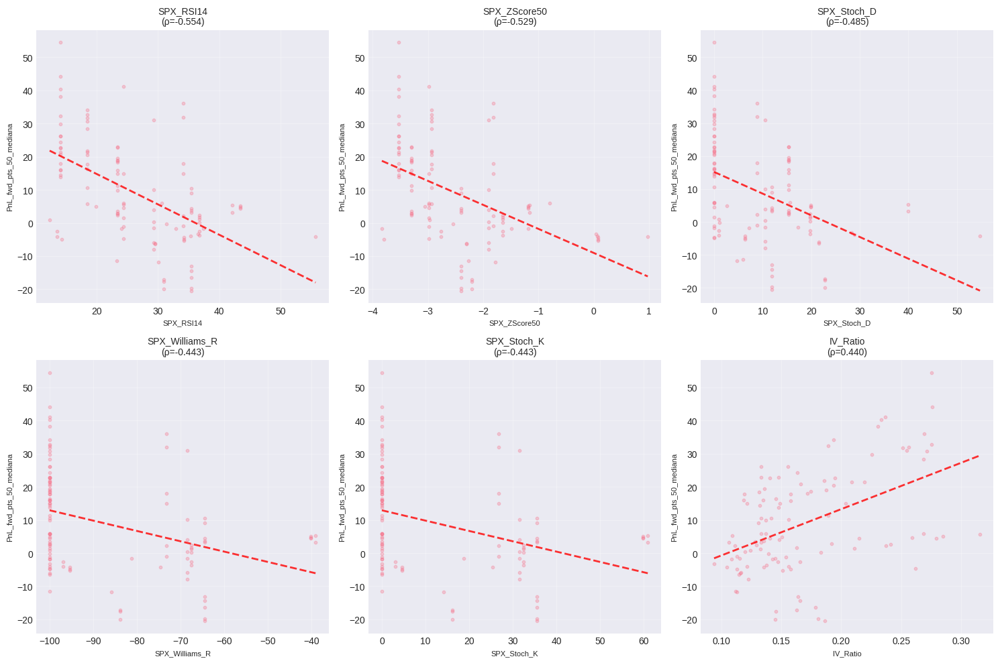
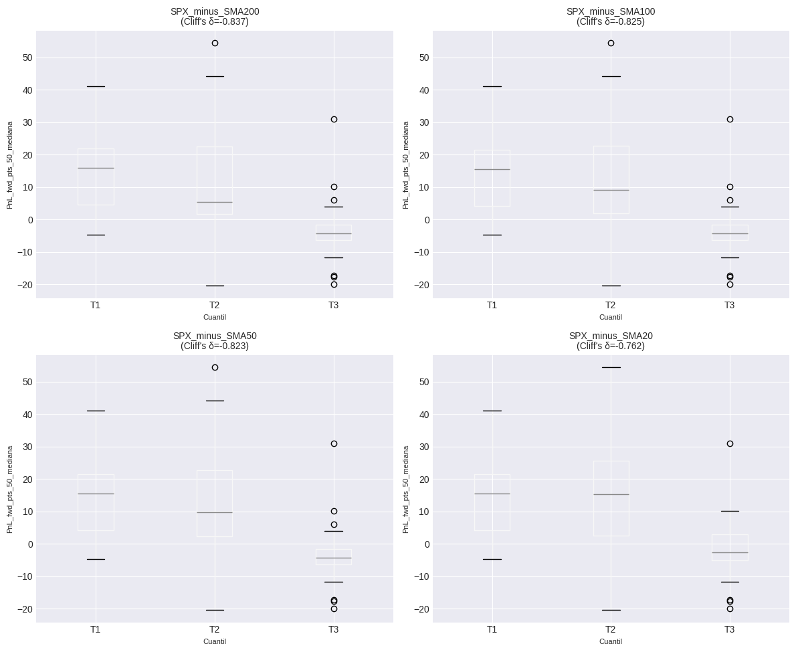
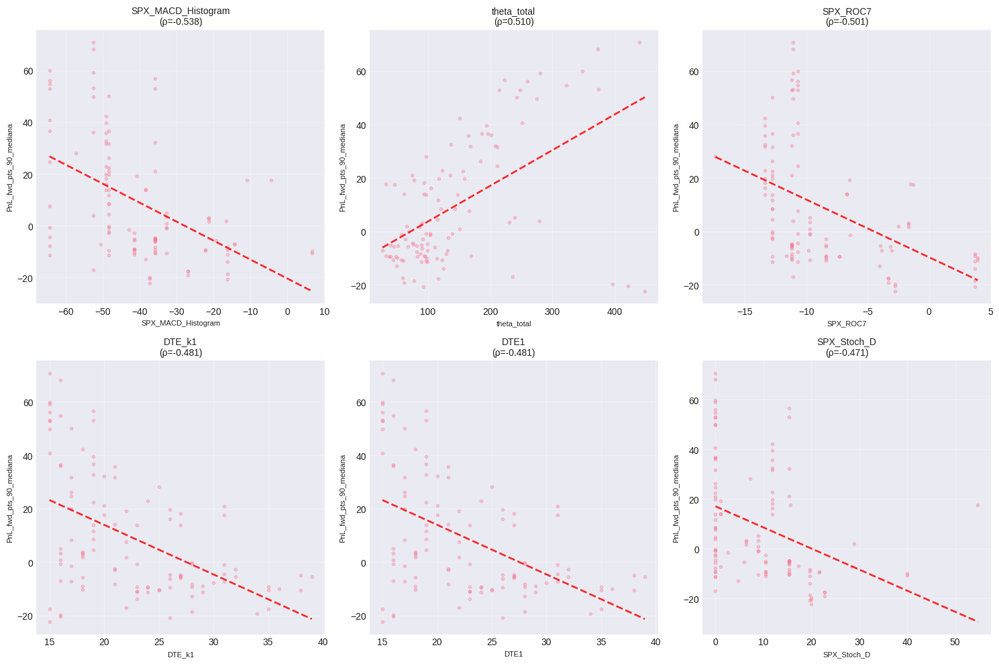
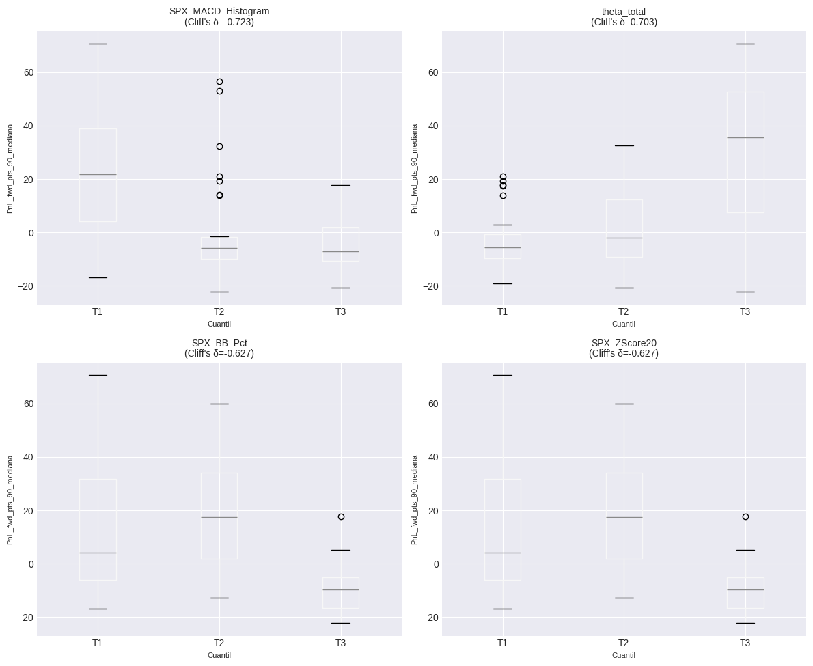

# RESUMEN EJECUTIVO
## Hallazgos Accionables (Top 10)

- **SPX_RSI14** correlaciona -0.554 con PnL_fwd_pts_50_mediana (p_adj=0.0000, N=109)
- **SPX_ZScore50** correlaciona -0.529 con PnL_fwd_pts_50_mediana (p_adj=0.0000, N=109)
- **SPX_Stoch_D** correlaciona -0.485 con PnL_fwd_pts_50_mediana (p_adj=0.0000, N=109)
- **SPX_minus_SMA200**: Quintil superior vs inferior → Δ mediana = -20.18 puntos (Cliff's δ=-0.837, p=0.0000)
- **SPX_minus_SMA100**: Quintil superior vs inferior → Δ mediana = -19.67 puntos (Cliff's δ=-0.825, p=0.0000)
- **SPX_MACD_Histogram** correlaciona -0.538 con PnL_fwd_pts_90_mediana (p_adj=0.0000, N=109)
- **theta_total** correlaciona 0.510 con PnL_fwd_pts_90_mediana (p_adj=0.0000, N=109)
- **SPX_ROC7** correlaciona -0.501 con PnL_fwd_pts_90_mediana (p_adj=0.0000, N=109)
- **SPX_MACD_Histogram**: Quintil superior vs inferior → Δ mediana = -28.89 puntos (Cliff's δ=-0.723, p=0.0000)
- **theta_total**: Quintil superior vs inferior → Δ mediana = 41.39 puntos (Cliff's δ=0.703, p=0.0000)

# ANÁLISIS PREDICTIVO - CALENDAR SPREADS
## 1. VALIDACIÓN INICIAL DE DATOS
**FILTROS APLICADOS:**
1. DTE2 - DTE1 > 10 días: 5,965 registros (28.8%)
2. FF_ATM > 0.7: 2,421 registros (11.7%)
3. **COMBINADOS (1 AND 2): 110 registros (0.5%)**
- Registros originales: 20,745
- Registros eliminados: 20,635

**Tamaño muestral:** N = 110 registros
**Columnas totales:** 120
**Período:** 2020-02-25 a 2025-11-21

**Target PnL_fwd_pts_50_mediana:**
  - Valores válidos: 109 (99.1%)
  - Media: 9.03
  - Mediana: 5.08
  - Std: 15.49

**Target PnL_fwd_pts_90_mediana:**
  - Valores válidos: 109 (99.1%)
  - Media: 9.15
  - Mediana: -0.19
  - Std: 23.29

## 2. CONTROL ANTI-LEAKAGE
**Columnas excluidas por leakage:** 22
```
  - PnL_fwd_pct_25
  - PnL_fwd_pct_25_mediana
  - PnL_fwd_pct_50
  - PnL_fwd_pct_50_mediana
  - PnL_fwd_pct_90
  - PnL_fwd_pct_90_mediana
  - PnL_fwd_pts_25
  - PnL_fwd_pts_25_mediana
  - PnL_fwd_pts_50
  - PnL_fwd_pts_90
  - SPX_chg_pct_25
  - SPX_chg_pct_50
  - SPX_chg_pct_90
  - dia_fwd_25
  - dia_fwd_50
  - dia_fwd_90
  - hora_fwd_25
  - hora_fwd_50
  - hora_fwd_90
  - net_debit_fwd_25
  - net_debit_fwd_50
  - net_debit_fwd_90
```

**Features permitidas (numéricas):** 87

## 3. CALIDAD DE DATOS
**Filas duplicadas:** 0

**Registros válidos para análisis:** 109

## 4. CORRELACIONES BASELINE - PnL_fwd_pts_50_mediana
### Top 20 Features por Correlación de Spearman

| Feature | r_Spearman | p_adj | r_Pearson | N |
|---------|------------|-------|-----------|---|
| SPX_RSI14 | -0.5539*** | 0.0000 | -0.5446 | 109 |
| SPX_ZScore50 | -0.5288*** | 0.0000 | -0.4647 | 109 |
| SPX_Stoch_D | -0.4855*** | 0.0000 | -0.4298 | 109 |
| SPX_Williams_R | -0.4430*** | 0.0000 | -0.3540 | 109 |
| SPX_Stoch_K | -0.4430*** | 0.0000 | -0.3540 | 109 |
| IV_Ratio | 0.4404*** | 0.0000 | 0.4735 | 109 |
| theta_total | 0.4315*** | 0.0000 | 0.2981 | 109 |
| SPX_minus_SMA20 | -0.4147*** | 0.0001 | -0.3631 | 109 |
| WIDTH | 0.4038*** | 0.0001 | 0.3234 | 109 |
| PnLPICO | 0.3992*** | 0.0001 | 0.2970 | 109 |
| SPX_minus_SMA50 | -0.3956*** | 0.0001 | -0.2826 | 109 |
| SPX_minus_SMA200 | -0.3953*** | 0.0001 | -0.2685 | 109 |
| RANK_PRE | 0.3952*** | 0.0001 | 0.3834 | 109 |
| SPX_minus_SMA7 | -0.3920*** | 0.0002 | -0.3479 | 109 |
| SPX_minus_SMA100 | -0.3842*** | 0.0002 | -0.2635 | 109 |
| Ratio_T2_T1 | 0.3736*** | 0.0003 | 0.4008 | 109 |
| SPX_ROC7 | -0.3640*** | 0.0005 | -0.3966 | 109 |
| SPX_MACD_Histogram | -0.3638*** | 0.0005 | -0.3999 | 109 |
| _tau | 0.3499*** | 0.0008 | 0.3855 | 109 |
| DTE_diff | 0.3499*** | 0.0008 | 0.3855 | 109 |

*Significancia: *** p<0.001, ** p<0.01, * p<0.05 (FDR ajustado)*

## 5. REGLAS POR UMBRALES Y CUANTILES - PnL_fwd_pts_50_mediana
### Top Reglas por Cuantiles (Quintiles)

| Feature | Top Q1 Median | Bottom Q5 Median | Δ Median | Cliff's δ | p-value |
|---------|---------------|------------------|----------|-----------|----------|
| SPX_minus_SMA200 | -4.20 | 15.97 | -20.18 | -0.837 | 0.0000 |
| SPX_minus_SMA100 | -4.22 | 15.45 | -19.67 | -0.825 | 0.0000 |
| SPX_minus_SMA50 | -4.20 | 15.45 | -19.65 | -0.823 | 0.0000 |
| SPX_minus_SMA20 | -2.55 | 15.45 | -18.00 | -0.762 | 0.0000 |
| SPX_RSI14 | 0.66 | 18.80 | -18.14 | -0.687 | 0.0000 |
| SPX_ROC7 | -2.58 | 15.90 | -18.47 | -0.667 | 0.0000 |
| SPX_ZScore50 | 0.17 | 16.00 | -15.82 | -0.638 | 0.0000 |
| SPX_MACD_Histogram | -1.80 | 16.18 | -17.98 | -0.568 | 0.0000 |
| SPX_minus_SMA7 | 0.74 | 15.45 | -14.71 | -0.564 | 0.0001 |
| IV_Ratio | 21.40 | 2.42 | 18.97 | 0.543 | 0.0001 |
| RANK_PRE | 16.35 | -0.25 | 16.60 | 0.531 | 0.0001 |
| WIDTH | 10.50 | -1.80 | 12.30 | 0.519 | 0.0001 |
| theta_total | 20.45 | -1.29 | 21.74 | 0.510 | 0.0002 |
| PnLPICO | 10.50 | -1.68 | 12.18 | 0.496 | 0.0002 |
| Ratio_T2_T1 | 21.45 | 3.20 | 18.25 | 0.481 | 0.0004 |

## 6. ANÁLISIS ESPECIAL VIX - PnL_fwd_pts_50_mediana
### Correlaciones VIX Features

| Feature | r_Spearman | p-value | Interpretación |
|---------|------------|---------|----------------|
| VIX_ROC_5 | 0.1488 | 0.1317 | - No sig. |
| VIX_slope_5 | 0.0740 | 0.4532 | - No sig. |
| VIX_SMA_5 | 0.0577 | 0.5587 | - No sig. |
| VIX_above_SMA_5 | 0.0713 | 0.4701 | - No sig. |
| VIX_ROC_10 | 0.2583 | 0.0098 | ✓ Moderada |
| VIX_slope_10 | 0.1698 | 0.0913 | - No sig. |
| VIX_SMA_10 | 0.0710 | 0.4827 | - No sig. |
| VIX_above_SMA_10 | 0.0676 | 0.5038 | - No sig. |
| VIX_ROC_20 | 0.3195 | 0.0023 | 🔥 Fuerte |
| VIX_slope_20 | 0.3271 | 0.0017 | 🔥 Fuerte |
| VIX_zscore_20 | 0.3413 | 0.0071 | 🔥 Fuerte |
| VIX_SMA_20 | -0.0404 | 0.7057 | - No sig. |
| VIX_above_SMA_20 | 0.2208 | 0.0365 | ✓ Moderada |

### VIX por Quintiles

- **Δ Mediana (Q5 vs Q1):** -2.46
- **Cliff's Delta:** -0.132
- **p-value:** 0.3526

| Quintil | N | Median | Mean | Std |
|---------|---|--------|------|-----|
| Q1 | 49 | 4.40 | 8.28 | 17.39 |
| Q2 | 34 | 16.16 | 15.41 | 11.32 |
| Q3 | 26 | 1.94 | 2.09 | 13.46 |

## 7. FEATURE ENGINEERING - PnL_fwd_pts_50_mediana
Trabajando con top 10 features...

### Top Features Derivadas

| Feature Derivada | r_Spearman | p-value |
|------------------|------------|----------|
| SPX_RSI14_div_IV_Ratio | -0.6499*** | 0.0000 |
| SPX_ZScore50_div_SPX_Stoch_D | -0.5776*** | 0.0000 |
| SPX_RSI14_rank | -0.5539*** | 0.0000 |
| SPX_RSI14_log | -0.5539*** | 0.0000 |
| SPX_RSI14_zscore | -0.5539*** | 0.0000 |
| SPX_ZScore50_div_SPX_Stoch_K | -0.5457*** | 0.0000 |
| SPX_RSI14_div_SPX_ZScore50 | -0.5435*** | 0.0000 |
| SPX_ZScore50_rank | -0.5288*** | 0.0000 |
| SPX_ZScore50_zscore | -0.5288*** | 0.0000 |
| SPX_ZScore50_log | 0.5281*** | 0.0000 |
| SPX_Stoch_D_div_SPX_Williams_R | -0.5224*** | 0.0000 |
| SPX_RSI14_div_SPX_Williams_R | -0.5197*** | 0.0000 |
| SPX_Stoch_D_div_IV_Ratio | -0.4999*** | 0.0000 |
| SPX_Stoch_D_rank | -0.4855*** | 0.0000 |
| SPX_Stoch_D_log | -0.4855*** | 0.0000 |

## 8. VALIDACIÓN OUT-OF-SAMPLE - PnL_fwd_pts_50_mediana
**Validación:** TimeSeriesSplit con 5 folds
**Features usadas:** 10
**Muestras:** 109

### Resultados OOS por Modelo

| Modelo | MAE | R² | Spearman |
|--------|-----|-----|----------|
| Ridge | 17.439 ± 7.157 | -8.138 ± 13.687 | 0.045 ± 0.446 |
| Lasso | 18.439 ± 7.443 | -8.604 ± 14.073 | 0.006 ± 0.427 |

❌ **Conclusión:** NO hay señal predictiva consistente OOS

## 9. VISUALIZACIONES - PnL_fwd_pts_50_mediana




## 4. CORRELACIONES BASELINE - PnL_fwd_pts_90_mediana
### Top 20 Features por Correlación de Spearman

| Feature | r_Spearman | p_adj | r_Pearson | N |
|---------|------------|-------|-----------|---|
| SPX_MACD_Histogram | -0.5381*** | 0.0000 | -0.4861 | 109 |
| theta_total | 0.5101*** | 0.0000 | 0.5420 | 109 |
| SPX_ROC7 | -0.5007*** | 0.0000 | -0.4609 | 109 |
| DTE_k1 | -0.4812*** | 0.0000 | -0.4973 | 109 |
| DTE1 | -0.4812*** | 0.0000 | -0.4973 | 109 |
| SPX_Stoch_D | -0.4712*** | 0.0000 | -0.3688 | 109 |
| SPX_minus_SMA20 | -0.4632*** | 0.0000 | -0.4579 | 109 |
| IV_Ratio | 0.4173*** | 0.0001 | 0.5276 | 109 |
| SPX_minus_SMA7 | -0.4111*** | 0.0001 | -0.4159 | 109 |
| WIDTH | 0.3945*** | 0.0002 | 0.3903 | 109 |
| Ratio_T2_T1 | 0.3874*** | 0.0002 | 0.3913 | 109 |
| PnLPICO | 0.3751*** | 0.0004 | 0.4112 | 109 |
| SPX_ZScore50 | -0.3597*** | 0.0008 | -0.3119 | 109 |
| CQR | 0.3240** | 0.0037 | 0.3106 | 109 |
| net_debit_mediana | 0.3173** | 0.0042 | 0.3165 | 109 |
| SPX_RSI14 | -0.3173** | 0.0042 | -0.2778 | 109 |
| SPX_BB_Pct | -0.3118** | 0.0047 | -0.2877 | 109 |
| SPX_ZScore20 | -0.3118** | 0.0047 | -0.2877 | 109 |
| net_debit | 0.2902** | 0.0100 | 0.2976 | 109 |
| SPX_Stoch_K | -0.2878** | 0.0100 | -0.2878 | 109 |

*Significancia: *** p<0.001, ** p<0.01, * p<0.05 (FDR ajustado)*

## 5. REGLAS POR UMBRALES Y CUANTILES - PnL_fwd_pts_90_mediana
### Top Reglas por Cuantiles (Quintiles)

| Feature | Top Q1 Median | Bottom Q5 Median | Δ Median | Cliff's δ | p-value |
|---------|---------------|------------------|----------|-----------|----------|
| SPX_MACD_Histogram | -7.16 | 21.73 | -28.89 | -0.723 | 0.0000 |
| theta_total | 35.75 | -5.64 | 41.39 | 0.703 | 0.0000 |
| SPX_BB_Pct | -9.60 | 4.21 | -13.81 | -0.627 | 0.0000 |
| SPX_ZScore20 | -9.60 | 4.21 | -13.81 | -0.627 | 0.0000 |
| SPX_ROC7 | -9.18 | 13.78 | -22.95 | -0.620 | 0.0000 |
| SPX_minus_SMA20 | -9.30 | 14.36 | -23.66 | -0.613 | 0.0000 |
| SPX_ZScore50 | -9.03 | 8.36 | -17.39 | -0.589 | 0.0000 |
| WIDTH | 31.73 | -5.70 | 37.43 | 0.588 | 0.0000 |
| SPX_minus_SMA7 | -9.10 | 14.36 | -23.46 | -0.581 | 0.0000 |
| Ratio_T2_T1 | 31.61 | -5.38 | 36.99 | 0.573 | 0.0000 |
| SPX_Stoch_D | -9.18 | 8.43 | -17.61 | -0.567 | 0.0000 |
| DTE_k1 | -5.76 | 8.36 | -14.12 | -0.527 | 0.0001 |
| DTE1 | -5.76 | 8.36 | -14.12 | -0.527 | 0.0001 |
| IV_Ratio | 31.61 | -5.44 | 37.05 | 0.522 | 0.0001 |
| PnLPICO | 31.73 | -5.59 | 37.31 | 0.484 | 0.0003 |

## 6. ANÁLISIS ESPECIAL VIX - PnL_fwd_pts_90_mediana
### Correlaciones VIX Features

| Feature | r_Spearman | p-value | Interpretación |
|---------|------------|---------|----------------|
| VIX_ROC_5 | 0.0739 | 0.4559 | - No sig. |
| VIX_slope_5 | -0.0657 | 0.5055 | - No sig. |
| VIX_SMA_5 | 0.1132 | 0.2501 | - No sig. |
| VIX_above_SMA_5 | 0.0566 | 0.5666 | - No sig. |
| VIX_ROC_10 | 0.2725 | 0.0064 | ✓ Moderada |
| VIX_slope_10 | 0.1898 | 0.0585 | - No sig. |
| VIX_SMA_10 | 0.0811 | 0.4225 | - No sig. |
| VIX_above_SMA_10 | 0.1073 | 0.2878 | - No sig. |
| VIX_ROC_20 | 0.2872 | 0.0064 | ✓ Moderada |
| VIX_slope_20 | 0.3082 | 0.0031 | 🔥 Fuerte |
| VIX_zscore_20 | 0.2925 | 0.0222 | ✓ Moderada |
| VIX_SMA_20 | -0.0514 | 0.6302 | - No sig. |
| VIX_above_SMA_20 | 0.2701 | 0.0100 | ✓ Moderada |

### VIX por Quintiles

- **Δ Mediana (Q5 vs Q1):** 4.54
- **Cliff's Delta:** 0.137
- **p-value:** 0.3328

| Quintil | N | Median | Mean | Std |
|---------|---|--------|------|-----|
| Q1 | 49 | -2.38 | 1.70 | 15.95 |
| Q2 | 34 | 14.36 | 21.33 | 29.66 |
| Q3 | 26 | 2.16 | 7.26 | 19.48 |

## 7. FEATURE ENGINEERING - PnL_fwd_pts_90_mediana
Trabajando con top 10 features...

### Top Features Derivadas

| Feature Derivada | r_Spearman | p-value |
|------------------|------------|----------|
| SPX_ROC7_div_DTE_k1 | -0.7344*** | 0.0000 |
| SPX_ROC7_div_DTE1 | -0.7344*** | 0.0000 |
| SPX_MACD_Histogram_div_DTE_k1 | -0.6147*** | 0.0000 |
| SPX_MACD_Histogram_div_DTE1 | -0.6147*** | 0.0000 |
| theta_total_div_SPX_Stoch_D | 0.5666*** | 0.0000 |
| SPX_MACD_Histogram_rank | -0.5381*** | 0.0000 |
| SPX_MACD_Histogram_zscore | -0.5381*** | 0.0000 |
| SPX_MACD_Histogram_log | 0.5370*** | 0.0000 |
| SPX_MACD_Histogram_div_SPX_Stoch_D | -0.5258*** | 0.0000 |
| theta_total_div_DTE_k1 | 0.5212*** | 0.0000 |
| theta_total_div_DTE1 | 0.5212*** | 0.0000 |
| SPX_ROC7_div_SPX_Stoch_D | -0.5131*** | 0.0000 |
| theta_total_rank | 0.5101*** | 0.0000 |
| theta_total_log | 0.5101*** | 0.0000 |
| theta_total_zscore | 0.5101*** | 0.0000 |

## 8. VALIDACIÓN OUT-OF-SAMPLE - PnL_fwd_pts_90_mediana
**Validación:** TimeSeriesSplit con 5 folds
**Features usadas:** 10
**Muestras:** 109

### Resultados OOS por Modelo

| Modelo | MAE | R² | Spearman |
|--------|-----|-----|----------|
| Ridge | 20.248 ± 3.238 | -1.292 ± 1.830 | 0.269 ± 0.405 |
| Lasso | 19.210 ± 2.844 | -1.077 ± 1.817 | 0.318 ± 0.397 |

✅ **Conclusión:** Señal predictiva FUERTE encontrada (Spearman OOS > 0.3)

## 9. VISUALIZACIONES - PnL_fwd_pts_90_mediana




